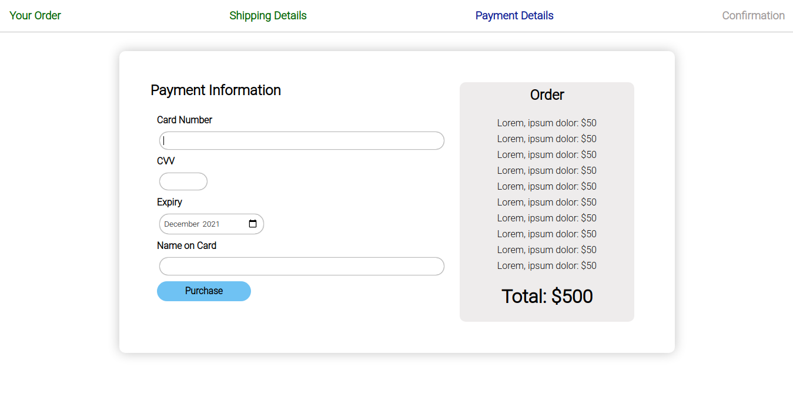

# Daily UI Design Challenge

### Day 001 - Create a sign up page

### Day 002 - Create a sign up page

### Day 003 - Create a sign up page

### Day 004 - Create a calculator

### Day 005 - Create a App Icon

### Day 006 - Create a User Profile
<<<<<<< HEAD

### Day 007 - Create Settings Page

=======

>>>>>>> e0a2b1ab7d8da32aa8421a8519a93151e2742214
