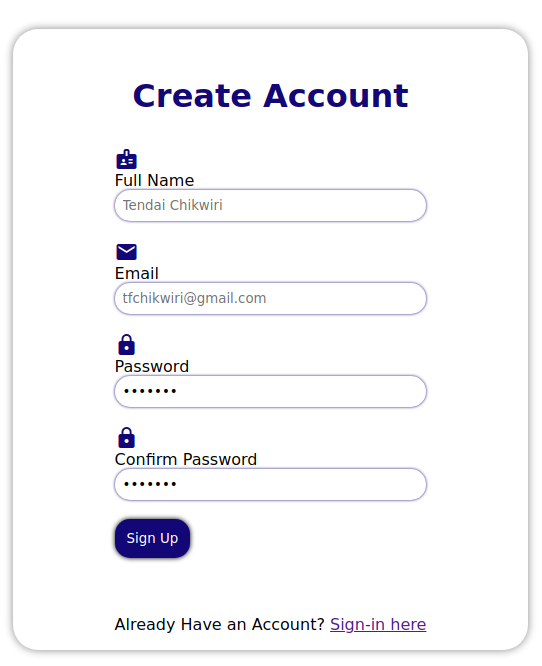

# Daily UI Design Challenge

### Day 001 - Create a sign up page

### Day 002 - Credit Card Check-out

### Day 003 - Create a Landing Page

### Day 004 - Create a Calculator

### Day 005 - Create a App Icon

### Day 006 - Create a User Profile

### Day 007 - Create Settings Page

### Day 008 - Create 404 Not Found Page

### Day 009 - Create Music Player

